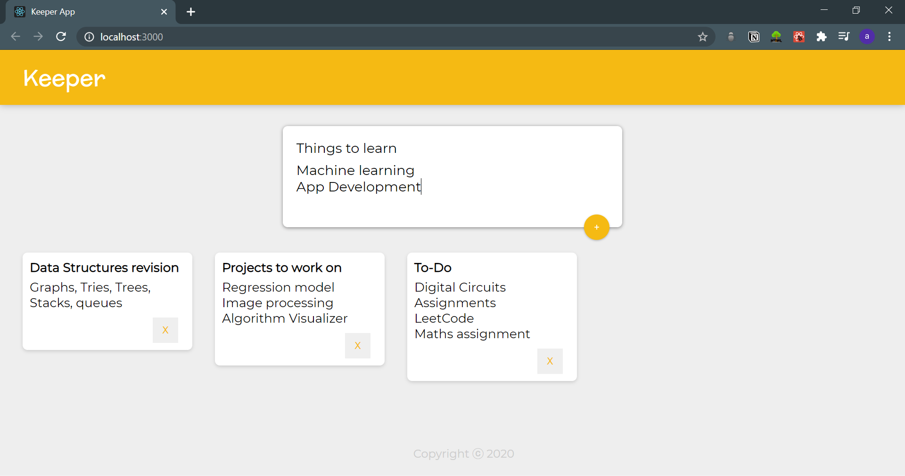

# Note-Keeper
### A React app for keeping all the notes at one place. Developed using React Frontend Interface for JavaScript.

## Things I learned :
#### -JSX and Babel
#### -Javascript Expression in JSX & ES6 Template Literals
#### -Inline Styling
#### -Dev tools
#### -React Components
#### -Props
#### -Mapping
#### -Event Handlers
#### -React Forms
#### -Changing State, Hooks, and more

## Installation 
#### -Clone the repo
#### -route to the directory in terminal
#### -git clone git@github.com:abhilasha007/Note-keeper.git
#### -open the folder in the editor of your choice
#### -route to the directory in terminal
#### -yarn install/ npm install - installs all the dependencies and packages
#### -yarn start/ npm start
##### all the basic installation to run react application should be configured
